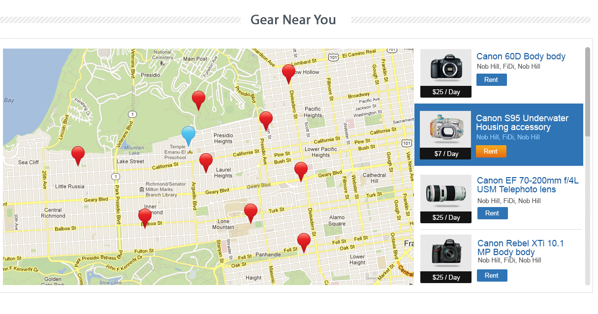

## Description

MapList is a jQuery plugin that makes it easy to create maps that are linked
to scrolling lists, a la the Yelp Search Results page. Clicking an entry
highlights the map marker, and also vice versa. For mobile devices, the map
stacks on top of the list.

## Proposed API

    %ul#gear-near-you
      %li{ data: { latlongs: [[37.7930944, -122.4169949], [37.7930944, -122.4169949]] } }
        .left
          %img{ src: item_path(item) }
          $7/day
        .right
          %a.title{ href: '/items/3' } Canon 60D
          .location Nob Hill, Fidi
          %a.btn{ href: '/items/3' } Rent &raquo;

and initialize it with:

    $('#gear-near-you').maplist({ mapSelector: '#gear-near-you-map' })

which will fill the map at mapSelector with the latlongs from the li's.

## Design Mockup

